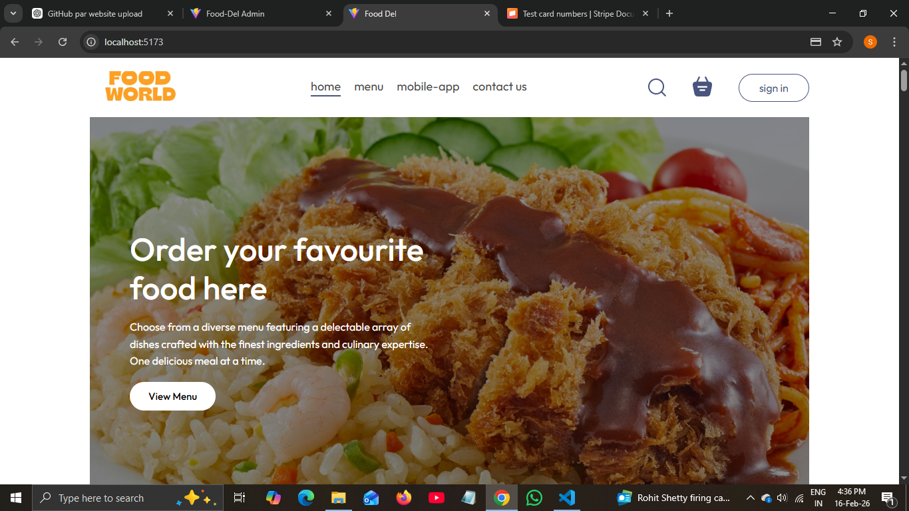
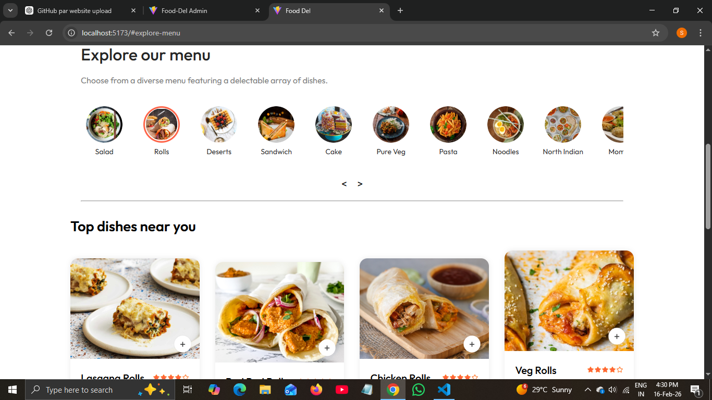
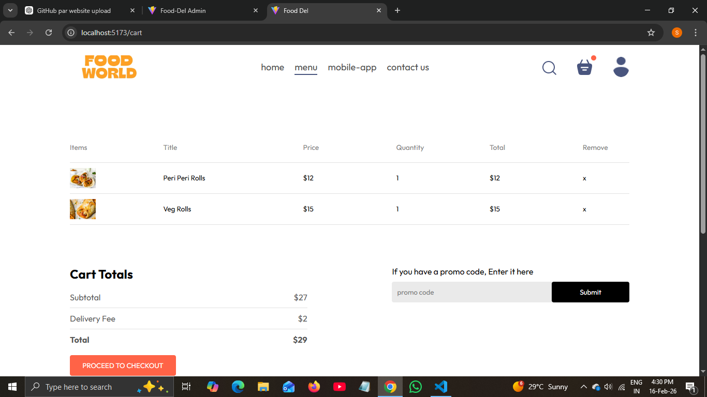
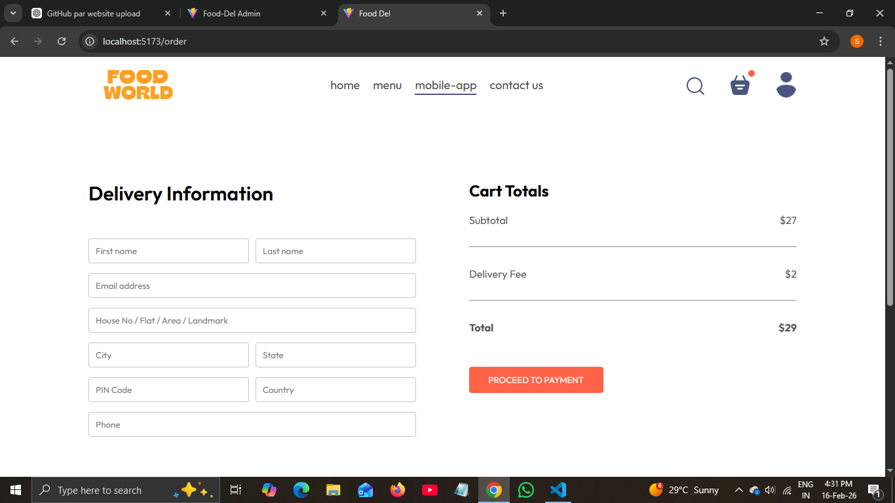
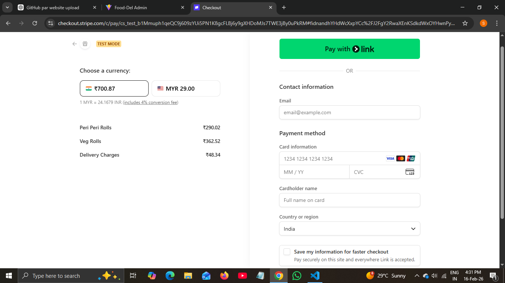
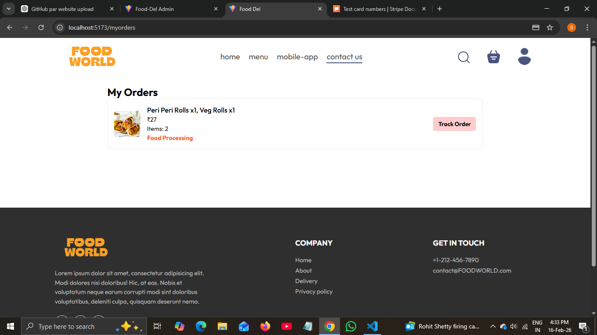
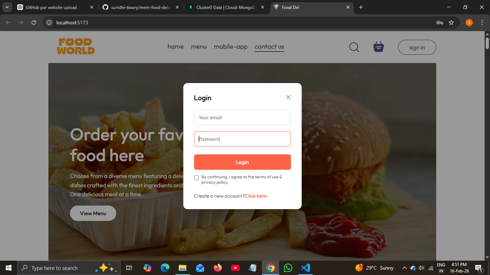
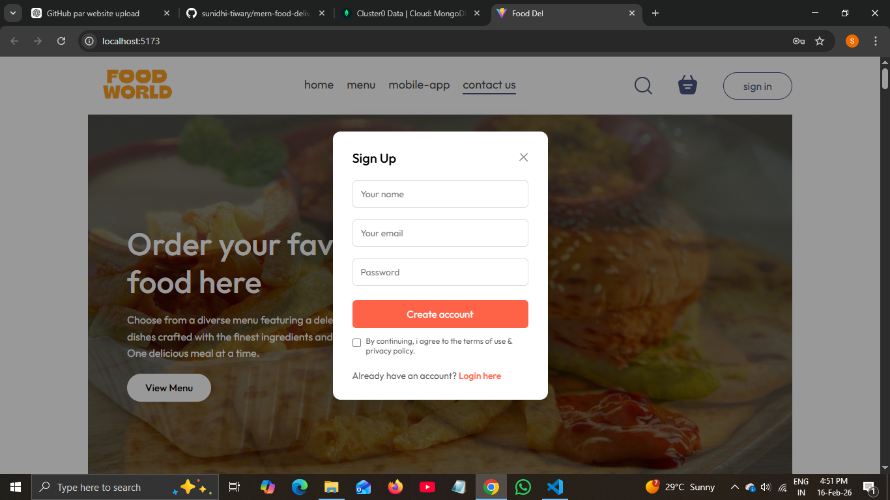

# MERN Food Delivery App

This is a full stack Food Delivery Web Application built using the MERN Stack.

## 🚀 Tech Stack
- MongoDB
- Express.js
- React.js
- Node.js
- Stripe Payment Integration

## 📂 Project Structure
- frontend → User website
- admin → Admin dashboard
- backend → Server and API

## 🔑 Features
- User Registration and Login
- Add to Cart
- Online Payment using Stripe
- Order Management
- Admin Panel for managing food items

## ⚙️ Installation

1. Clone the repository
2. Install dependencies

Backend:
npm install

Frontend:
npm install

Admin:
npm install

3. Create a .env file in backend and add:

MONGO_URL=your_mongo_connection
STRIPE_SECRET_KEY=your_stripe_key

4. Run the project

Backend:
npm run server

Frontend:
npm run dev

Admin:
npm run dev

## 📸 Screenshots

### 🏠 Home Page

### 📋 Menu Page

### 🛒 Cart Page

### 💳 Checkout Page

### 💰 Payment Page

### 📦 Order Page

### 🔐 Login Page

### 📝 Signup Page

### 📱 App Download Page

---

## 🛠 Admin Panel

### ➕ Add Items

### 📋 List Items

### 📦 Orders Page

